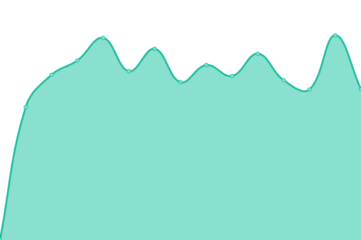
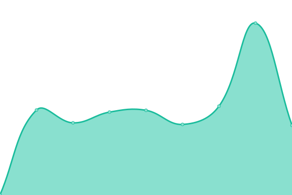

# [📈 Live Status](https://source-dream.github.io/upptime): <!--live status--> **🟧 Partial outage**

This repository contains the open-source uptime monitor and status page for [sourcedream](https://blog.sourcedream.cn), powered by [Upptime](https://github.com/upptime/upptime).

With [Upptime](https://upptime.js.org), you can get your own unlimited and free uptime monitor and status page, powered entirely by a GitHub repository. We use [Issues](https://github.com/source-dream/upptime/issues) as incident reports, [Actions](https://github.com/source-dream/upptime/actions) as uptime monitors, and [Pages](https://source-dream.github.io/upptime) for the status page.

<!--start: status pages-->
<!-- This summary is generated by Upptime (https://github.com/upptime/upptime) -->
<!-- Do not edit this manually, your changes will be overwritten -->
<!-- prettier-ignore -->
| URL | Status | History | Response Time | Uptime |
| --- | ------ | ------- | ------------- | ------ |
|  [ymbhp-api](https://api.sourcedream.cn) | 🟩 Up | [ymbhp-api.yml](https://github.com/source-dream/upptime/commits/HEAD/history/ymbhp-api.yml) | 

 1049ms
     
 | 

<a href="https://source-dream.github.io/upptime/history/ymbhp-api">99.82%</a>
    

|  [ymbhp-web](https://www.ymbhp.com) | 🟥 Down | [ymbhp-web.yml](https://github.com/source-dream/upptime/commits/HEAD/history/ymbhp-web.yml) | 

 2161ms
     
 | 

<a href="https://source-dream.github.io/upptime/history/ymbhp-web">98.79%</a>
    

|  webhook | 🟩 Up | [webhook.yml](https://github.com/source-dream/upptime/commits/HEAD/history/webhook.yml) | 

 1163ms
     
 | 

<a href="https://source-dream.github.io/upptime/history/webhook">99.85%</a>
    

<!--end: status pages-->

[**Visit our status website →**](https://source-dream.github.io/upptime)

## 📄 License

- Powered by: [Upptime](https://github.com/upptime/upptime)
- Code: [MIT](./LICENSE) © [Anand Chowdhary](https://anandchowdhary.com), supported by [Pabio](https://pabio.com)
- Data in the `./history` directory: [Open Database License](https://opendatacommons.org/licenses/odbl/1-0/)
